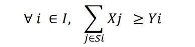
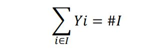
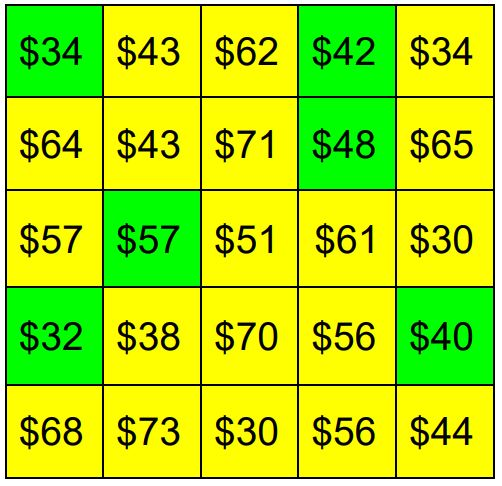

# WIA-logistics-AMPL
Project for logistics exam: Resolution of a linear problem using AMPL


## Assignement

### Introduction
WIA Communications is planning to bring wireless internet access to the town of Ames, Iowa. Using a geographic information system, WIA has divided Ames into the following 5 by 5 grid. The value in each block of the grid indicates the **expected annual revenue (in $1,000s)** WIA will receive if wireless internet service is provided to the geographic area represented by the block.

### Data 
Expected Annual Revenue by Area (in $1,000s)


<div>
<table border="1"style="text-align: center;">
  <tr><td .bg-yellow> $34</td><td> 	$43</td><td> 	$62 </td><td>	$42</td><td> 	$34</td></tr>
  <tr><td>$64</td><td>$43</td><td> 	$71</td><td> 	$48</td><td> 	$65</td></tr>
  <tr><td>$57</td><td>	$57</td><td> 	$51 </td><td>	$61</td><td> 	$30</td></tr>
  <tr><td>$32</td><td>	$38</td><td> 	$70</td><td> 	$56</td><td> 	$40</td></tr>
  <tr><td>$68</td><td> 	$73</td><td> 	$30</td><td> 	$56 </td><td>	$44</td></tr>
  </table>
</div>


WIA can build wireless towers in any block in the grid at a *cost of $150,000 per tower*. Each tower can provide wireless service to the block it is in and to all adjacent blocks (blocks are considered to be adjacent if they share a side; blocks touching only at cornerpoints are not considered adjacent). WIA would like to determine how many towers to build and where to build them to maximize profits in the first year of operations. 

***Note**: If a block can receive wireless service from two different towers, the revenue for that block should be counted only once.*

```DAT
data;
param totArea=25;
 
param near: 1 2 3 4 5 6 7 8 9 10 11 12 13 14 15 16 17 18 19 20 21 22 23 24 25 :=
         1  1 1 0 0 0 1 0 0 0 0  0  0  0  0  0  0  0  0  0  0  0  0  0  0  0
         2  1 1 1 0 0 0 1 0 0 0  0  0  0  0  0  0  0  0  0  0  0  0  0  0  0
         3  0 1 1 1 0 0 0 1 0 0  0  0  0  0  0  0  0  0  0  0  0  0  0  0  0
         4  0 0 1 1 1 0 0 0 1 0  0  0  0  0  0  0  0  0  0  0  0  0  0  0  0
         5  0 0 0 1 1 0 0 0 0 1  0  0  0  0  0  0  0  0  0  0  0  0  0  0  0
         6  1 0 0 0 0 1 1 0 0 0  1  0  0  0  0  0  0  0  0  0  0  0  0  0  0 
         7  0 1 0 0 0 1 1 1 0 0  0  1  0  0  0  0  0  0  0  0  0  0  0  0  0
         8  0 0 1 0 0 0 1 1 1 0  0  0  1  0  0  0  0  0  0  0  0  0  0  0  0
         9  0 0 0 1 0 0 0 1 1 1  0  0  0  1  0  0  0  0  0  0  0  0  0  0  0
         10 0 0 0 0 1 0 0 0 1 1  0  0  0  0  1  0  0  0  0  0  0  0  0  0  0
         11 0 0 0 0 0 1 0 0 0 0  1  1  0  0  0  1  0  0  0  0  0  0  0  0  0
         12 0 0 0 0 0 0 1 0 0 0  1  1  1  0  0  0  1  0  0  0  0  0  0  0  0
         13 0 0 0 0 0 0 0 1 0 0  0  1  1  1  0  0  0  1  0  0  0  0  0  0  0
         14 0 0 0 0 0 0 0 0 1 0  0  0  1  1  1  0  0  0  1  0  0  0  0  0  0
         15 0 0 0 0 0 0 0 0 0 1  0  0  0  1  1  0  0  0  0  1  0  0  0  0  0
         16 0 0 0 0 0 0 0 0 0 0  1  0  0  0  0  1  1  0  0  0  1  0  0  0  0 
         17 0 0 0 0 0 0 0 0 0 0  0  1  0  0  0  1  1  1  0  0  0  1  0  0  0 
         18 0 0 0 0 0 0 0 0 0 0  0  0  1  0  0  0  1  1  1  0  0  0  1  0  0 
         19 0 0 0 0 0 0 0 0 0 0  0  0  0  1  0  0  0  1  1  1  0  0  0  1  0  
         20 0 0 0 0 0 0 0 0 0 0  0  0  0  0  1  0  0  0  1  1  0  0  0  0  1
         21 0 0 0 0 0 0 0 0 0 0  0  0  0  0  0  1  0  0  0  0  1  1  0  0  0
         22 0 0 0 0 0 0 0 0 0 0  0  0  0  0  0  0  1  0  0  0  1  1  1  0  0
         23 0 0 0 0 0 0 0 0 0 0  0  0  0  0  0  0  0  1  0  0  0  1  1  1  0 
         24 0 0 0 0 0 0 0 0 0 0  0  0  0  0  0  0  0  0  1  0  0  0  1  1  1
         25 0 0 0 0 0 0 0 0 0 0  0  0  0  0  0  0  0  0  0  1  0  0  0  1  1;
         
param cost=150;

param EAR:= 1  34  2  43 3  62 4  42  5  34 
            6  64  7  43 8  71 9  48 10  65
            11 57  12 57 13 51 14 61 15  30
            16 32  17 38 18 70 19 56 20  40
            21 68  22 73 23 30 24 56 25  44;
            
```

### Tasks
1. Formulate an ILP model for the problem of WIA Communications.
2. Implement the model using the modeling language AMPL, and solve it by means of CPLEX.
3. Suppose WIA Communications is required to provide wireless service to all of the blocks. Formulate the variant of the problem in terms of PLI.
4. Solve the variant of the problem using AMPL and CPLEX. 
5. Compare the optimal solutions found in points 2 and 4: how much money will WIA make in the first year in the two scenarios?

## The model 

The WIA Communications problem requires profit maximization.
We have both costs and revenues data, they only need to be activated or not. This we can do
with the use of **two different binary variables**. First we define ***𝐼*** *as a set of the 25 areas* e
we instantiate the two variables:
- **Xi** : 1 if we place a tower in the area ; 0 otherwise
- **Yi** : 1  is the area covered by the service or not ; 0 otherwise

It therefore appears as a ***coverage location problem***; and as per manual, we define
subsets of 𝐼, one for each area which we will call ***𝑺𝒊*** and which will contain the adjacent areas
to the area 𝑖 and the area 𝑖 itself. They would be the areas that would receive coverage if there was one
tower in 𝑖 (or the areas that would cover 𝑖 if there was a tower).

So 𝑌𝑖 is 1 if and only if at least one 𝑋𝑗 for 𝑗 belonging to 𝑆𝑖 and 1

We immediately express the objective function, that is the maximization of profit in
first year:


.. where with 𝐸𝐴𝑅𝑖 we indicate the estimated annual earnings for the area 𝑖.


We clearly understand that the thrust of this still unconstrained function involves values obliged:
- **Xi** : = 0 ∀𝑖
- **Yi** = 1  ∀𝑖

Once this is done, it is necessary to impose as said before but in a different way, that if no Xj for j
belonging to Si is 1, then Yi is 0. It can be written like this:




To answer point 3 of the delivery, which requires coverage of all areas, it is sufficient
add the constraint:



...where with # 𝐼 we indicate the cardinality of the set 𝐼, that is the total number of areas.

In fact, nothing conflicts with the previously expressed constraints, and the function of
maximization remains equally valid. However, by doing this we would have instantiated one
variable 𝑌𝑖 which has become superfluous, as it is always 1 and is no longer a variable but a datum.
So let's slightly change the linear model previously described,
by modifying the objective function and the only expressed constraint. The modification simply consists
in replacing '1' where it previously appeared 𝑌𝑖.
This is the situation:


## Implementation 

Firt annoying task to complete is to write the data in a readable manner in a *DAT file*. Find it at the <a href="#Data">data paragraph</a>.


After writing the mathematical model, the *MOD file* should be written. It is read by *AMPLIDE*.


```AMPL
param totArea;
set Area:=1.. totArea;

param near{Area,Area} binary;
param EAR{Area} >=0;
param cost >=0;

var tower{Area} binary;
var covered{Area} binary;


maximize Profit:sum{i in Area} (EAR[i]*covered[i]-cost*tower[i]);
subject to Covered{i in Area}:sum{j in Area}near[i,j]*tower[j]>=covered[i];
```
Answering the third request of the assignment needs only a changement: use the constraint to force all cells be covered by the service.
So just need to modify the *MOD file* in the following manner:

```AMPL

subject to Covered{i in Area}:sum{j in Area}near[i,j]*tower[j]>=1;

```

# Results 
 
We have implemented both cases with AMPL and now we can compare the results obtained.

In the tables the areas that would host a tower are highlighted in green and in yellow those that
they receive coverage

In the first delivery we get a profit of $ 377,000 in the first year.


With the second model we can reach a profit of $ 219,000, lower later
to the introduction of a further constraint.
Obviously all the boxes are highlighted.




            

           
